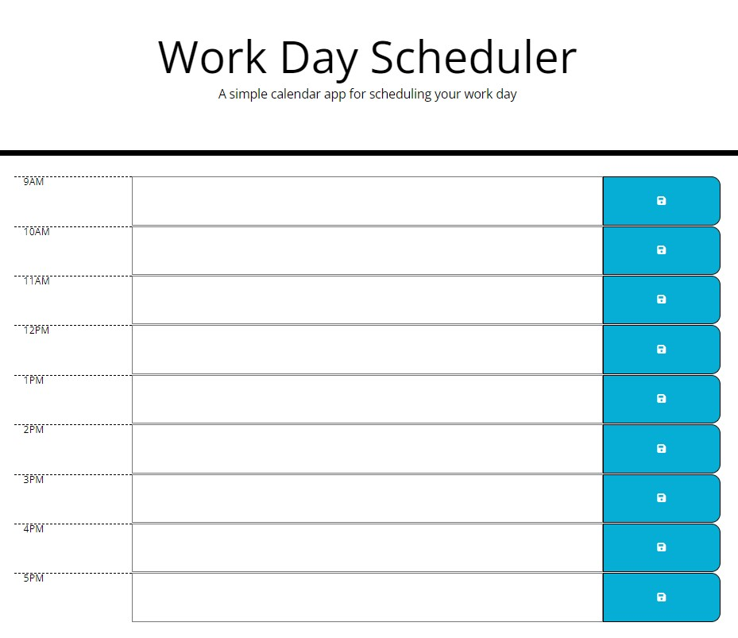

# Third-Party-APIs-Challenge-Work-Day-Schedule

# Description

A simple calendar application that allows a user to save events for each hour of the day by modifying starter code. This app runs in the browser and features dynamically updated HTML and CSS powered by jQuery.

# Planning Notes:

1. create the HTML of the hour blocks in the calendar 9 - 5 ✔️
   -create these using divs

2. current day displayed at top of calendar ✔️
   -enter this using moment.js

3. depending on the time of day - the blocks are color coded to show past, present, and future.
   -use a function with moment.js in it to determin with if / else statements on what colour the time blocks / divs should be.

4. be able to click into the timeblock to enter an event name for that hour and a save button on each of the blocks that saves the event in local storage.
    - give each time block its own <input?> for each timeblock that when saved - it then displays the value in the box.

# Screenshots:

# Links:

GitHub: https://github.com/NessJade96/Third-Party-APIs-Challenge-Work-Day-Scheduler
Deploy: https://nessjade96.github.io/Third-Party-APIs-Challenge-Work-Day-Scheduler/

# Commit notes:

Commit 1:
Created repo - created css, js, and readme files and linked to index.html. Wrote up a plan and started on the html. Had to reset up the fontawesome links in the head for the save/ floppydisk icon.

Commit 2:
Used moment.js to add in the current date in the <header>

Commit 3:
Started to try and figure out the time blocks color - but decided to move onto the saving calendar events. I created click handler on the save buttons so they save and continue to display the value once typed - even when the page is refreshed. Only working on the 9am hour atm.
